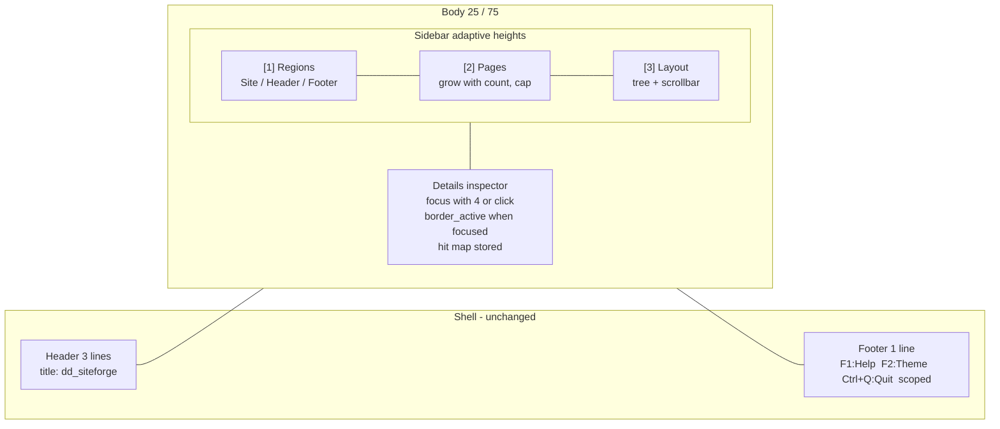
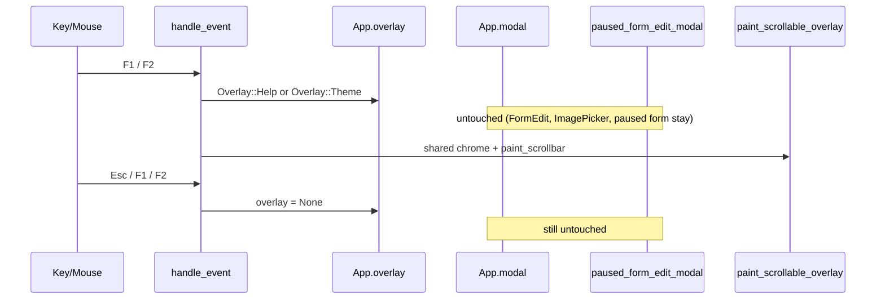

# dd_siteforge TUI Product Elevation

| Field | Value |
|---|---|
| **Author** | TUI architecture review |
| **Date** | 2026-09-03 |
| **Status** | Draft |
| **Crate** | `dd_siteforge` 1.6.0 (`Cargo.toml`) |
| **Scope** | Incremental elevation of the existing Ratatui TUI. No rewrite, no new framework, no shared-crate extraction. |

---

## Overview

`dd_siteforge` is a single-binary terminal CMS for authoring 5–20-page marketing sites. The TUI (`src/tui/`, ~16k LOC including 98 tests) already ships a real product: typed `Site` tree, unified `FormEdit`, ASCII blueprints, F1/F2 overlays, autosave + `.backup`, validation-gated export, and `p` preview via local HTTP. That identity stays.

What it is not, yet, is a top-tier terminal product. The living docs (`README.md`, `src/tui/help.rs`, `LDNDDEV_TUI_VISUAL_STANDARD.md`) claim chrome and mouse behavior the code does not implement. The body layout is a fixed 25/75 split with a 6+8-row sidebar that clips the Pages list well below the 5–20-page target. `App` is a god object (~20 selection indices, 6 expansion `HashSet`s, a parallel Help/Theme overlay system). `cursor.rs` (1225 lines) still hand-writes every field apply.

This document is an honest audit of the current TUI, a concrete set of layout / usability / functionality / manageability changes, and a phased PR plan in which every PR is independently reviewable and mergeable. Behavior-neutral refactors land before the UX that depends on them. Site JSON schema does not bump; new UI state stays in-memory.

---

## Background & Motivation

### Product contract (already decided)

From `docs/SPEC.md`:

- Single Rust binary. Typed `Site` tree. Framework-native static export.
- Target: small marketing sites, one editor.
- Non-goals: multi-user, auth, live CMS, database, remote CDN.
- Visual chrome: 3-line header + 1-line adaptive footer, `ldnddev` token set.
- Workflow: `init-site` → TUI → `npx grunt build` → `Shift+E` / `p`.

The TUI is the product. A mediocre TUI makes the whole crate look unfinished even when export and validation are solid.

### Current state (verified)

The shell matches the visual standard's vertical split (`draw.rs` lines 15–22: header `Length(3)`, body `Min(0)`, footer `Length(1)`). Theme lookup order is correct (`theme.rs` `AppTheme::load`: `./dd_siteforge_theme.yml` → `~/.config/ldnddev/dd_siteforge_theme.yml` → built-in). Version `1` is enforced with a Warning toast. FormEdit + `drill_stack`, image/page pickers, autosave, F3, `Shift+E`, `p`, Pages CRUD, and Layout vim nav all work and must not be "fixed."

The gaps are concentrated in four places:

1. **Claimed vs shipped** — help, README, and the visual standard describe F2 in the footer, scrollbar drag, wheel-per-pane, a cursor overlay, and a Details panel that is a first-class focus target. None of those are true in code.
2. **Body layout** — sidebar heights are constants (`Length(6)` / `Length(8)` / `Min(1)`). Details never gets `border_active`. Layout has no scrollbar.
3. **Binding surface** — global + 3 panels + form + pickers, no command palette, no site-settings editor, `/` is insert (keep it), no list filter.
4. **Code shape** — `App` + `cursor.rs` + copy-pasted Header/Footer tree arms + three scrollbar painters. Every future UX change is more expensive than it should be.

### Pain for a daily author of a 12-page site

- Pages list shows ~6 titles; the rest are off-screen with no pane-local wheel.
- Clicking Layout or Header/Footer fires an Info toast every time.
- Footer never mentions F2. Help still says `[2] Nodes`. README ASCII still says `[2] Nodes` and advertises theme paths the loader does not search.
- Wheel over Regions/Pages moves the Layout tree (`select_prev` / `select_next`).
- `PageUp`/`PageDown` always scroll Details, even with Layout focused.
- Site name, `lang`, `base_url`, `export_dir`, and CSS `ThemeSettings` are only reachable via JSON or the first-export prompt.
- Adding a component means touching `components/dd-*.md` + `model.rs` + `renderer.rs` + `EditForm` + a new arm in the 1225-line `cursor.rs` apply match.

---

## Goals & Non-Goals

### Goals

- Make the shipped TUI match its docs and the `ldnddev` visual standard (honesty first).
- Raise layout, mouse, and keyboard to "top-tier terminal product" for one editor on 80×24 (degraded) and 120×40 (comfortable).
- Add the power-user surfaces a daily author actually hits: command palette, site settings, list filter, redo, Details focus.
- Reduce the cost of the next component and the next chrome change via targeted, behavior-neutral refactors.
- Keep every PR independently reviewable. Stacked PRs on one `feat/<short-name>` branch are enough; do not require a unique branch per docs tweak. Prefixes `tui:` / `docs:` / `test:`.

### Non-goals

- Rewrite the TUI, switch Ratatui for a retained-widget library, or extract a shared `ldnddev_tui` crate.
- Multi-user, auth, live CMS, database, remote CDN (already in `docs/SPEC.md`).
- Immediate-mode HTML preview pane inside the TUI. Keep `p` (export + local HTTP + browser).
- Site JSON schema bump. TUI-only UI state stays in `App`. Site settings writes existing `Site` fields (`name`, `lang`, `base_url`, `export_dir`, `theme`).
- Codegen of `EditForm` from `components/dd-*.md` in this effort (later; see Alternatives).
- Proactive rustfmt-only PRs, unrequested features, first-run "press F1" coach marks (footer already starts with `F1:Help`).
- Replacing vim keys with the command palette. Palette is additive.

---

## Honest audit of the current TUI

LOC (including tests) as of this review: `src/tui/` totals **15,980**. Hotspots: `cursor.rs` 1225, `tree/build.rs` 906, `tree/items.rs` 813, `tree/open.rs` 744, `details/ascii.rs` 654, `tree/edit.rs` 600, `draw.rs` 586, `mod.rs` 388, `events.rs` 398, `tests.rs` 1920 (98 `#[test]`s). Crate-wide tests are ~148; `Architecture.md` still says 96.

### What already works (do not "fix")

| Surface | Where | Notes |
|---|---|---|
| 3-line header + 1-line footer shell | `draw.rs` 15–22, 28–50, 360–362 | Heights are correct. Tagline is `choose_header_copy` (time XOR pid). |
| Theme load order + version:1 rejection | `theme.rs` `AppTheme::load` | Local → global → default. Warning toast on skip. |
| Unified FormEdit + `drill_stack` | `modals/mod.rs` `Modal::FormEdit`, `modals/form_edit.rs` | Nested collection items round-trip via Ctrl+S. |
| Image picker `./source/images/` + page picker `/<slug>` | `modals/pickers.rs`, `form_edit.rs` Ctrl+P | Works. Heuristic on field id is the gap, not the pickers. |
| Autosave 2s + manual `.backup` + mismatch toast | `mod.rs` `tick_autosave`, `commit_save_with_backup`, `App::new` | Help documents this accurately. |
| F3 validation modal / success toast | `events.rs` F3 → `open_validation_modal` | Blocking errors stay in a modal. Correct. |
| `Shift+E` export gate | `modals/export.rs` | Validates first. Prompts for `export_dir` on first use, then persists it. |
| `p` preview | `modals/export.rs` `ensure_preview_server` + `open_in_browser` | Stdio pinned to `/dev/null` (`util.rs`). |
| Pages add/delete/undo/reorder/rename | `events.rs` `try_handle_pages_panel_key` | Scoped to `SidebarSection::Pages`. |
| Layout vim nav | `events.rs` 213–241, `tree/nav.rs`, `tree/edit.rs` | `hjkl`, `g/G`, Space, `y/d/u`, `J/K`, `C/V`, `c/v`. |
| Click-to-focus on form inputs | `modal_field_areas: RefCell` | Captured at draw, hit-tested in `modals/events.rs`. |
| Toasts | `modals/toasts.rs` | Bottom-right, ~5s, cap 4. Missing Error (see gaps). |
| Component fuzzy insert (`/`) | `tree/open.rs` `filtered_component_kinds` | Fuzzy score + header-only gate for `dd-header-search` / `dd-header-menu`. |
| Test helper `send_key` | `tests.rs` 25–28 | Drive via events. Keep this convention. |

### Visual standard gaps (confirmed)

All of the following were re-read in source. None dropped.

1. **Footer missing `F2:Theme`.** `footer_hint` in `src/tui/details/panel.rs` (lines 6–66) always starts with `F1:Help` then jumps to app actions and `Ctrl+Q:Quit`. No band includes `F2:Theme`. No widest-band mouse reminder. Overlay band is `F1:Help  Esc:Close  Ctrl+Q:Quit`. Standard §4: `F1:Help`, then `F2:Theme`, then quit, then app actions; mouse reminder only on the widest band.

2. **Header title includes version.** `draw.rs` line 30: `.title(format!("dd_siteforge v{}", env!("CARGO_PKG_VERSION")))`. Standard §3: `.title("<app>")` — product name only. Version already appears in F2 (`help.rs` `build_theme_text`: `"dd_siteforge v{version}"`).

3. **README invents theme paths.** `AppTheme::load` searches only `./dd_siteforge_theme.yml` then `~/.config/ldnddev/dd_siteforge_theme.yml`. README "Theme" section also lists `./theme.yml`, `./.theme.yml`, `~/.config/ldnddev/dd_siteforge/.theme.yml`. Align README to the standard. Do not add lookup paths.

4. **`AppTheme` uses non-canonical field names.** `theme.rs` `AppTheme`: `background`, `panel_background`, `popup_background`, `foreground`, `muted`, `title`, `active`, `input_default`, `input_focus`, `selected_foreground`, plus `#[allow(dead_code)]` on the struct. F2 samples `background` / `popup_background` (`help.rs` 283–300), not `base_background` / `body_background` / `modal_background` / `text_primary`.

5. **Extra YAML key `active`.** `PaletteFile.active: Option<String>` is deserialized. Standard: "Do not invent other keys." Default theme YAML (`dd_siteforge_theme.yml`) does not set it; `from_palette` still accepts it and falls back to `#6ec8ff`.

6. **Omitted-key semantic fallbacks do not match the family palette.** `from_palette` (lines 281–284):

   ```text
   success  unwrap_or("#1e8449")   Default impl / standard: #82e0aa
   warning  unwrap_or("#b9770e")   Default impl / standard: #f5c469
   error    unwrap_or("#a93226")   Default impl / standard: #e57373
   info     unwrap_or("#21618c")   Default impl / standard: #5dade2
   ```

   Additional mismatches found in the same function (not in the original brief, included because they fail the same rule — "fallback when a key is omitted should use the family defaults"):

   | Key | `from_palette` fallback | `Default` / standard |
   |---|---|---|
   | `border_active` | `#6ec8ff` | `#64B4F5` |
   | `text_disabled` | `#a0a4a8` | Default impl `Rgb(90,95,102)` (also disagrees with standard optional `#A0A4A8`) |
   | `text_inverse` | `#f9fafb` | Default impl `Rgb(15,17,20)` (standard optional `#F9FAFB`) |

   A theme that omits `success` therefore paints a different green than a missing theme file. That is a load-path footgun.

7. **Cursor overlay stub.** `draw.rs` `set_cursor_for_active_input` (582–585) always returns `None`. The draw path still allocates an overlay painter (562–579) that never runs. Standard: 1-cell overlay with `bg(cursor)`.

   What actually paints a caret today:

   - Single-input prompts (`modals/prompts.rs` 178–197) already do the right thing: `Paragraph::new(" ").bg(self.theme.cursor)` plus `frame.set_cursor_position`.
   - FormEdit single-line and textarea fields (`modals/paint.rs` 287–294, `form_textarea.rs` `render_cursor_line`) insert a `▋` glyph colored with `input_text_focus`, **not** `theme.cursor`.

   Unify on the prompt path: overlay cell `bg(theme.cursor)`, glyph optional.

8. **`ToastLevel` has no Error.** `modals/mod.rs` 145–149: `Success | Info | Warning`. `theme.error` exists and F2 even samples it as `"error toasts"`. Validation uses a modal (correct). Failed save, autosave, preview-server, and FormEdit apply all use `Warning` (`mod.rs` 297, 383; `form_edit.rs` 126; `export.rs` 120–128). Add `Error` for genuine failures.

9. **Help/Theme are a second overlay system.** `App.show_help` / `show_theme` + `help_scroll` / `theme_scroll` pairs. Event handling in `events.rs` 92–190 is ~50 lines copy-pasted twice (j/k, PageUp/Down, g/G, wheel). Draw chrome + cell-by-cell scrollbar in `draw.rs` is ~70 lines × 2 (help 364–462, theme 464–553), plus a third copy for Details (308–358) and a fourth in `form_textarea.rs` `render_textarea_scrollbar` / `paint.rs` form scroller. `Modal` already exists with four-point plumbing (`docs/SPEC.md` "New modal").

10. **`count_wrapped_lines` ignores width.** `help.rs` 318–320: `text.lines.len()`. Fine because `build_help_text` already wraps, but the name and the `draw.rs` comment ("wrapped row count") claim wrap-aware counting. Either rename to `count_lines` or actually count wraps.

### Layout gaps (confirmed)

1. **Fixed sidebar.** `draw.rs` 23–26 body is `Percentage(25)` / `Percentage(75)`, not user-resizable (keep; resizing is out of scope). Sidebar 63–70:

   ```rust
   Constraint::Length(6), // Regions (Header, Footer)
   Constraint::Length(8), // Pages
   Constraint::Min(1),    // Layout
   ```

   Regions holds 2 items in a 6-row bordered pane (2 wasted inner rows). Pages inner height ≈ 6, so titles clip after ~6 — product target is 5–20 pages. Layout gets leftovers. `layout_list_state.offset()` is used for click index math (`events.rs` 311) but **no scrollbar is painted**, and `PageUp`/`PageDown` always call `scroll_details_by` (`events.rs` 221–222).

2. **Details never gets `border_active`.** `draw.rs` 297: `.border_style(Style::default().fg(self.theme.border))` unconditionally. `SidebarSection` is `Regions | Pages | Layouts` only (`mod.rs` 75–79). Keyboard cannot focus Details; only wheel (when the cursor is over it) and PageUp/PageDown scroll it.

3. **Pane titles use `theme.title` at rest.** Regions/Pages/Layout/Details titles (`draw.rs` 120–123, 193–196, 247–250, 298–301) are always `theme.title` (derived from `modal_labels` / `text_active_focus`). SPEC Theme convention: `text_labels` at rest → `text_active_focus` when that pane is focused. Selected *rows* use `selected_foreground` (= `text_primary`), not `text_active_focus` as standard §6 requires (`selected_background` + `text_active_focus`).

4. **Details hit-testing parses painted text.** Unique product view is `details/ascii.rs` (654 lines) — keep it. Click path (`panel.rs` `select_item_from_details_click` / `select_page_from_details_lines`) walks lines looking for `"item: "`, `" column: "`, `"dd-"`, `"dd-hero"`, `"dd-section"`. `header_details_text` discards `_h_hits` and returns `vec![]` for the hit map; `footer_details_text` same with `_f_hits`. Footer region clicks no-op: `select_item_from_details_click` match arm `_ => return`. Meanwhile `draw.rs` 276 computes `(details_content, _details_hits)` and **drops the hits**. The page-click path re-generates hits inside `select_page_from_details_lines` (line 295) — the draw-time map is the one that should be stored.

5. **Toast on every Layout/region click.** `events.rs` 316: `push_toast(Info, "Selected {label}")` on Layout row click. 355 / 360: `"Selected Header region."` / `"Selected Footer region."`. Keyboard `handle_up`/`handle_down` in Regions (`tree/nav.rs` 84, 114) fire the same toasts. Noisy. Toast on mutations and errors only.

6. **80-col chrome.** 25% of 80 = 20 cols for three bordered lists. `[2] Pages 12/20` already overflows that title. Footer truncates with `.chars().take(width)` (`panel.rs` 65), which can cut mid-key (`Ctrl+Q:Qui`). Standard: no clipped chrome under 80 cols.

### Usability / keybinding gaps (confirmed)

1. **Naming drift — pick Pages.** README ASCII: `[2] Nodes`. Help section title: `"Pages panel ([2] Nodes)"` (`help.rs` 171). Draw title: `[2] Pages` (`draw.rs` 174–179). Architecture.md already says `[2] Pages`. Product name is Pages.

2. **Help lies.** `"Select row in Nodes tree"` (`help.rs` 150). `"Click panel/list"` claims Details is a focusable panel (228–230). `"Scrollbar track/thumb"` jump/scroll and `"Wheel / drag scroll"` (233–234). Events handle `ScrollUp`/`ScrollDown` and `Down(Left)` only — **no `MouseEventKind::Drag`**, no click-on-track. Form textarea has `render_textarea_scrollbar`; Details/help/theme paint their own `│`/`█` cells.

3. **Wheel targeting is wrong.** `events.rs` 258–270: if the cursor is over `details_area`, scroll Details; **else** `select_prev`/`select_next` (Layout tree). Wheel over Regions or Pages therefore walks the Layout tree. Hit-test the pane under the cursor. `contains` already exists (`util.rs` 3–5) and `regions_area` / `pages_area` / `list_area` are already captured.

4. **Scoped `r` / `u` not in footer.** Pages: `r` rename, `u` undo-delete-page. Layout: `r` column-id, `u` tree-undo. Footer Layout band currently shows `u:Undo` but not `r`. Footer should always show the scoped meaning. `p` is global preview — not insert-mode, so not a typing problem; still easy to fat-finger. Keep `p`; surface it only on the wide Layout band (already true).

5. **Enter vs Ctrl+S in FormEdit.** Help lists **both** `"Enter" = "Confirm edit / save"` and `"multiline ↑/↓/Enter" … Ctrl+S saves"` (`help.rs` 213–216). Actual behavior in `form_edit.rs`:

   | Chord | Behavior |
   |---|---|
   | **Ctrl+S** | Drill: write item into parent and pop. Top-level: `apply_edit_form_to_component`, close. |
   | **Enter** on SubForm | Drill into selected item. |
   | **Enter** on Textarea | Insert newline. |
   | **Enter** on other fields | `focus_next()`. |
   | **Esc** | Drill: discard item, pop. Top-level: cancel. |

   Modal chrome already says `Ctrl+S: save` (`paint.rs` 88, `ModalConfig` default). Help's `"Enter" = Confirm edit / save` is false. Document Ctrl+S; do not make Enter save (it would break textarea and SubForm drill).

6. **No command palette.** Binding surface is large. Biggest single usability upgrade for a power user without removing vim keys.

7. **`/` is insert, not filter.** `events.rs` 228: `Char('/') => open_component_picker()`. Standard tree recipe says `/` filters if the list can get long. Muscle memory in README, Architecture, and help is insert. Keep `/` as insert; add `Ctrl+F` filter on the focused list (Pages or Layout).

8. **No site-level editor.** `Site` (`model.rs` 4–23) has `name`, `theme: ThemeSettings { primary_color, secondary_color, tertiary_color, support_color }`, `export_dir`, `base_url`, `lang`. These are set via JSON or the first-export `ExportPathPrompt`. No TUI path to edit CSS theme colors or `lang` / `base_url` / site name.

9. **Dirty star in footer only.** `footer_hint` prefixes `*  ` when `dirty`. No header dirty badge. Keep this — standard forbids persistent status in the footer except this star, which is already the established pattern.

10. **Undo is a full `Site` snapshot stack, cap 20, no redo.** `undo_stack: Vec<Site>` (`mod.rs` 114). Pages have a separate `deleted_pages` trash. Coarse but acceptable. Later PR: redo (`Ctrl+R`) on the same stack.

11. **Dirty detection re-serializes the whole site on every event.** `mark_dirty_if_changed` (`mod.rs` 327–338) `serde_json::to_string(&self.site)` vs `last_saved_json`. Fine at 5–20 pages. Generation counter later.

12. **Stale comment.** `try_handle_pages_panel_key` doc comment (`events.rs` 7): *"Future tasks populate this; today it always returns false."* The function is fully implemented. Delete the sentence.

13. **Insert picker context is incomplete.** `filtered_component_kinds` (`tree/open.rs` 607–618) only gates `HeaderSearch` / `HeaderMenu` to the header region. `dd-hero` is offered in Header/Footer; `insert_selected_component_kind` then calls `add_hero()`, which inserts into the **current page** (`open.rs` 458–461, 634–668). Footer still offers header-only kinds as false (they're gated) but Hero is a real mis-insert. Tighten allowed-kinds-for-context.

### Functionality gaps in product scope

See the priority table below. Extra findings beyond the original brief, all verified:

- Footer Layout tree (`build_footer_tree_rows`) is shallower than the header tree (no expand) and **reuses `selected_header_section/column/component`** (`build.rs` 628–654). Header and Footer selection cannot be independent; switching regions clobbers the other. This is a Selection-struct bug, not just a Grain smell.
- `CursorRef`'s `#[allow(dead_code)] // most variants unused until Tier A/B/C/D migrations` is stale — every variant is used in `apply_edit_form_to_component`. `pop_items` and `form_field_value_count` are truly unused. `Field.required` is `#[allow(dead_code)]` and **never read** (grep over `src/tui` finds only the field definition). `OptionalLinkTriple` is accepted by `EditFormState::new` and `paint.rs` has a stub arm `"Reserved — hero migration uses 3 flat fields instead."` — no `EditForm` literal uses it.
- Architecture.md Testing section still says "96 tests"; TUI module has 98, crate ~148.
- README TUI cheatsheet omits F2 entirely (Architecture and SPEC include it).
- Regions `j`/`k` is set-absolute (`handle_up` → Header, `handle_down` → Footer), not a list cursor. Adding a Site row **requires** rewriting this into a 3-item list.

### What is mediocre (works, but not top-tier)

- ASCII blueprints are the unique product view and they work for page sections. Header/footer maps exist but their hit maps are discarded, so click-to-select is a string parser. Double-click edit on a component inside a side-by-side column box is the one path that already uses hits (`select_page_from_details_lines` 294–310).
- Toasts fire on almost every structural mutation (`tree/columns.rs`, `tree/expand.rs`, `tree/open.rs`). Mutation toasts are acceptable; selection toasts are not. Some mutation toasts are Info for things that are Success (`"Added column…"`).
- FormEdit is unified and good. Live validation is absent: required fields are not indicated, URL fields are not checked until F3 / export. Apply failures surface as Warning toasts and the modal stays open — close to right, wrong severity.
- Help/Theme chrome is visually fine (centered 80×80, `modal_header` titles, scrollbar when overflowing). The problem is duplication, not look.
- 80×24 is technically usable (shell heights are fixed) but the 25% sidebar + 6+8 fixed rows + truncated footer make it feel broken rather than degraded.

---

## Key Decisions

### 1. Keep `/` as insert; filter is `Ctrl+F`

**Decision:** `/` stays the insert fuzzy picker. Filter on the focused list (Pages or Layout) is `Ctrl+F`. Resolved 2026-09-03.

**Rationale:** README, Architecture.md, SPEC.md, and F1 already document `/` as insert. That is muscle memory for anyone who has used this binary. The visual standard's tree recipe (`/` filters if the list can get long) is a default for file-browser apps, not a mandate to break this product. `Ctrl+F` is unused, is the family-wide "find" chord, and does not collide with Layout `f` (column width-class, unchorded). Do not steal `/`.

### 2. Help and Theme become a side `overlay` field, not `self.modal`

**Decision:** Replace `show_help` / `show_theme` + the four scroll fields with `App.overlay: Option<Overlay>`:

```rust
enum Overlay {
    Help { scroll: u16 },
    Theme { scroll: u16 },
}
```

Keep F1 / F2 as the open chords. **Do not put Help/Theme in `self.modal`. Do not pause FormEdit into `paused_form_edit_modal` for F1/F2.** That slot is exclusively the image/page picker sitting on FormEdit. Help/Theme sit *above* whatever is in `self.modal`, which is how the flags work today (`handle_modal_event` sets `show_help = true` and leaves `self.modal` in place, `modals/events.rs` 52–55).

A 4-line global intercept at the top of `handle_event` (and the existing F1 intercept in `handle_modal_event`, extended to F2) sets `overlay`. Esc / F1 / F2 close **only** the overlay. `self.modal` and `paused_form_edit_modal` are untouched.

F2 is not intercepted from modals today (only F1 is). Unification **does** start intercepting F2 from modals — same overlay-above-modal behavior as F1. That is an intentional honesty fix, not a pause.

Shared `paint_scrollable_overlay` + `paint_scrollbar` is the unification. Tests that assert `app.show_theme` switch to `matches!(app.overlay, Some(Overlay::Theme { .. }))`. Required test: FormEdit → Ctrl+P ImagePicker → F1 → Esc → Esc → FormEdit still open with the same field (picker Esc then form still there; overlay Esc must not drop the picker or the paused form).

**Not chosen:** (a) `Modal::Help` in `self.modal` — clobbers ImagePicker and the paused FormEdit behind it. (b) a real modal *stack* — out of scope; the two-slot model (`modal` + `paused_form_edit_modal`) plus a third overlay field is enough. (c) keeping the bool flags after this PR — later PRs must not reintroduce `show_help` / `show_theme`.

### 3. Details is a fourth focus target, not a fifth sidebar section

**Decision:** Add `SidebarSection::Details` (or rename the enum to `FocusPane::{Regions, Pages, Layout, Details}`). Key `4` focuses it, matching `1`/`2`/`3`. Clicking the Details pane focuses it. Focused Details uses `border_active`. When Details is focused: `j`/`k` and `PageUp`/`PageDown` scroll the blueprint; Enter / double-click still edit the current selection. `Tab` / `Shift+Tab` remain next/prev **page** (do not steal Tab for pane cycling).

**Rationale:** Details is an inspector, not a fourth stacked sidebar list. Standard §6: focused pane uses `border_active`. The inspector recipe (§7) already exists; this effort should extend it with "optional focus + `border_active` + j/k scroll" in a **tiny `docs:` PR (2.0) before** the Details-focus implementation (2.3), same sequencing as the command-palette recipe (5.0 before 5.1). A fifth sidebar row would steal Layout space on 24-row terminals.

### 4. Site settings live in Regions as a Site row, not a new pane

**Decision:** Regions becomes a 3-item list: **Site**, Header, Footer. Enter on Site opens a `FormEdit` bound to existing `Site` fields: `name`, `lang`, `base_url`, `export_dir`, `theme.primary_color` / `secondary_color` / `tertiary_color` / `support_color`. No schema bump. Adaptive sidebar heights (Phase 2) shrink Regions to content so the extra row is free.

**Site-selected chrome (required to implement):** add `SelectedRegion::Site`. When it is the current region:

| Surface | Behavior |
|---|---|
| Layout tree | One non-expandable row `Site settings` (`TreeRowKind::SiteRoot`). Not Grain. |
| Details | Read-only summary: name, lang, base_url, export_dir, four CSS colors. No hit map. |
| Enter / double-click | Open `SITE_FORM`. |
| `/` insert | No-op + Warning toast `"Insert is not available on Site settings."` |
| `C/V/c/v/r/f/d/y/J/K` | Warning `"Not available on Site settings."` (do not fall through to page column ops). |
| `p` preview | Unchanged (still current page). |
| Pages panel / `Tab` | Unchanged; `selected_page` is preserved while Site is focused. |

**`SelectedRegion` match arms that must gain a `Site` arm** (exhaustive today: `Header \| Footer \| Page`):

- `src/tui/tree/build.rs` `build_tree_rows` (6–9) → `build_site_tree_rows()` returning `[SiteRoot]`
- `src/tui/details/panel.rs` `details_text` (68–72), `select_item_from_details_click` (199–202; Site → no-op)
- `src/tui/tree/open.rs` `insert_selected_component_kind` (462–470), `filtered_component_kinds` (609; treat as not-header, empty allow-list)
- `src/tui/tree/columns.rs` every `if selected_region == Header` (39, 89, 151, 192, 243, 307) — Site must **not** take the else/page path; early-return the Warning
- `src/tui/draw.rs` region list highlight (95–97, 140–142) — three items, Site is index 0
- `src/tui/tree/nav.rs` `handle_up`/`handle_down` Regions arms (81–85, 111–115) — rewrite as a 3-item cursor (Site ↔ Header ↔ Footer), not set-absolute
- `src/tui/events.rs` region click (344–363), key `2` (still sets Page)
- `src/tui/tests.rs` any `SelectedRegion::` construction

**Independence:** PR 5.2 does **not** depend on Selection (3.1). It rewrites Regions as a 3-item cursor itself. 3.1 is a later cleanup. Site settings is in the **committed plan** (not gated on Phase 3).

**Rationale:** These fields already exist on the model and are otherwise JSON-only (except `export_dir`, which is a first-export prompt). A fourth sidebar pane would violate "no new pane" and steal Layout space. A `[HEAD]`-like row in the Layout tree would hide site settings when the user is in Header/Footer. Regions is the site-wide list.

### 5. Command palette is additive; vim keys stay

**Decision:** `:` (colon) opens a fuzzy action palette (pages, components, every documented chord). It does not rebind `hjkl`, `/`, `1/2/3/4`, F-keys, or FormEdit. Palette is an optional recipe in `LDNDDEV_TUI_VISUAL_STANDARD.md` **before** implementation (PR 5.0). The visual-standard recipe may keep `Ctrl+K` as the *illustrative* family default; **this app’s chord is `:`**. `:` is unused on the global keymap today.

**Idle-only:** `:` and `Ctrl+F` run only when `self.modal.is_none()` and `self.overlay.is_none()`. They do **not** preempt FormEdit the way F1 does. Palette is a blocking `Modal::Palette` in `self.modal` (same class as ComponentPicker), not a third overlay flag. Filter is inline on the focused list, not a modal.

Inside FormEdit, `:` types into the focused text field (correct — palette is idle-only). Do not intercept `:` in `handle_form_edit_event`. FormEdit `KeyCode::Char('k')` / `'j'` stay **unchorded** (`form_edit.rs` 248: sub-item / focus-prev). Add a `!CONTROL` guard on `Char('f')` so Ctrl+F is a no-op in forms rather than matching Layout `f`.

**Rationale:** User decision 2026-09-03. F1 is a read-only overlay; the palette is an action runner (Export/Quit from a half-edited form is surprising). Filter over a form is nonsense. Idle-only keeps FormEdit a focused session. Footer wide band: `: command` (not `Ctrl+K:Cmd`).

### 6. No shared crate extraction in this effort

**Decision:** Scrollbar helper, overlay chrome, and theme struct stay in `src/tui/`. Mention a future `ldnddev_tui` crate only as an alternative.

**Rationale:** There is one consumer. Extracting a crate mid-elevation doubles the PR surface (API, versioning, this repo + a new repo) for zero product gain. The visual standard remains the portable contract (copy the markdown, not a crate).

### 7. Grain unification: defer full Grain; optional Header/Footer `RegionGrain` in Phase 3b

**Decision:** **Do not** introduce `Region + Grain (Root/Section/Column/Component/Item)` across Header, Footer, **and** Page in this effort. **Do** land `Selection` and `ExpandKey` later (Phase 3, follow-on — not the committed ~18-PR cut). Resolved 2026-09-03. **Optionally** collapse Header*/Footer* `TreeRowKind` variants into `RegionGrain { region: Header|Footer, grain: Root|Section|Column|Component }` as Phase 3b if Selection still leaves painful match duplication.

**Size estimate:**

| Slice | Touch | Estimate | Verdict |
|---|---|---|---|
| `Selection { region, path: SelPath }` | `mod.rs`, `tree/build.rs` `apply_tree_row_selection` / `sync_tree_row_with_selection`, `events.rs` | ~1 PR, 1–2 days. Directly fixes Footer writing `selected_header_*`. **Not Grain** — path type is `PathSeg`, not `GrainIdx`. | **Do (Phase 3, follow-on).** |
| `ExpandKey` replacing 6 `HashSet`s + `header_column_expanded` | `mod.rs`, `tree/expand.rs`, `tree/build.rs` | ~1 PR, 1 day. Must preserve inverted polarity (see Proposed Design). Not Grain. Footer stays always-expanded. | **Do (Phase 3, follow-on).** |
| Header/Footer `RegionGrain` | `tree/mod.rs` kinds, `build.rs` labels + apply + sync (~4 duplicated match clusters), `open.rs` / `edit.rs` / `columns.rs` Header vs Footer arms | ~400–700 LOC mechanical, 3–5 days, high merge conflict with Phase 2/4. | **Phase 3b, optional.** |
| Full Grain including Page `Hero` / `PageHead` / 6 collection item kinds | `tree/{build,open,edit,items,expand,columns}.rs` (~3.5k LOC) | 1.5–2 weeks. Easy to regress insert/undo. | **Defer past this effort.** |

Full Grain is the right end state. It is also a 2-week sink that blocks every UX PR that touches the tree. Selection + ExpandKey give 80% of the "cannot drift" value.

### 8. Theme: rename Rust fields to canonical tokens in one PR; YAML stays `version: 1`

**Decision:** One PR maps `AppTheme` fields onto the standard names (`base_background`, `body_background`, `modal_background`, `text_primary`, `text_secondary`, …). Delete Rust aliases (`background`, `title`, `active`, `input_default`, `input_focus`, `selected_foreground`) once grep is clean. YAML schema stays `version: 1`. Keep YAML aliases `text` → `text_primary` and `subtext0` → `text_secondary` (already present). Drop deserializer field `active`. Do **not** add new YAML keys.

**Rationale:** F2 must sample canonical names; the struct should not disagree with the YAML. A version bump would invalidate in-the-wild `dd_siteforge_theme.yml` files for a rename-only change. `selected_row` text should use `text_active_focus` (standard §6), which also removes the need for `selected_foreground`.

---

## Proposed Design

### Target interaction model



### Overlay unification

Help/Theme share chrome with modals but **live in a side field**. `self.modal` is never Help or Theme. `paused_form_edit_modal` is never used for F1/F2.



Today: `handle_event` skips `handle_modal_event` while `show_help || show_theme` (`events.rs` 81–90); `handle_modal_event` sets `show_help = true` on F1 and returns Continue (`modals/events.rs` 52–55), leaving `self.modal` in place. After this PR the same shape holds with `overlay` instead of flags. F2 from modals starts working (today it does not).

Required regression: FormEdit → Ctrl+P ImagePicker → F1 → Esc (closes Help) → Esc (closes picker, restores FormEdit) → FormEdit still open with the same field. F1 must not write `paused_form_edit_modal`.

### Focus and mouse

```mermaid
flowchart TD
  click[Mouse event at x,y]
  click --> paneAt["pane_at(x,y) -> Regions / Pages / Layout / Details / Footer / Overlay"]
  paneAt --> wheel{Wheel?}
  wheel -->|Regions| pagesNav[select prev/next region row]
  wheel -->|Pages| pageNav[select prev/next page]
  wheel -->|Layout| treeNav[select_prev / select_next]
  wheel -->|Details| detailsScroll[scroll_details_by]
  wheel -->|Overlay| overlayScroll[modal scroll]
  paneAt --> down{Left down?}
  down -->|on scrollbar track| jump[proportional jump; Drag continues]
  down -->|on list row| select[select row; focus that pane]
  down -->|on Details content| hitMap[hit-test stored details_hits]
  down -->|on Details footer region| footerHit[select footer grain - currently a no-op]
```

New helper, lives in `events.rs` then moves to `tui/mouse.rs` in Phase 6:

```rust
#[derive(Clone, Copy, Debug, PartialEq, Eq)]
enum Pane { Regions, Pages, Layout, Details, Footer, Overlay }

fn pane_at(&self, x: u16, y: u16) -> Option<Pane> {
    if self.overlay.is_some() { return Some(Pane::Overlay); }
    if self.modal.is_some() { return Some(Pane::Overlay); } // form/picker consume mouse
    if contains(self.regions_area, x, y) { return Some(Pane::Regions); }
    if contains(self.pages_area, x, y) { return Some(Pane::Pages); }
    if contains(self.list_area, x, y) { return Some(Pane::Layout); }
    if contains(self.details_area, x, y) { return Some(Pane::Details); }
    None
}
```

### Scrollbar widget (Phase 1, bundled extract + click/drag)

One function used by Details, Help, Theme, FormEdit, textarea:

```rust
pub(crate) struct ScrollbarState {
    pub offset: usize,
    pub total: usize,
    pub visible: usize,
    pub track: Rect,          // captured at paint, hit-tested later
    pub dragging: bool,
}

pub(crate) fn paint_scrollbar(
    frame: &mut Frame,
    track: Rect,
    offset: usize,
    total: usize,
    visible: usize,
    theme: &AppTheme,
) { /* │ track + █ thumb; no-op if total <= visible */ }

pub(crate) fn scrollbar_click_offset(track: Rect, y: u16, total: usize, visible: usize) -> usize { /* … */ }
```

Replace four painters: `draw.rs` Details 308–358, Help 420–461, Theme 513–551, `form_textarea.rs` 117–165, plus the form-body scroller in `paint.rs` ~230–265.

Drag: on `MouseEventKind::Down` over `track`, set `dragging` and jump; on `Drag` while `dragging`, update offset; on `Up`, clear. This is the first (and only) use of `MouseEventKind::Drag` in the crate.

### Adaptive sidebar (Phase 2)

```rust
let region_rows = 2 /* borders */ + region_item_count; // 2 today, 3 with Site
let page_cap = 10; // inner titles visible
let page_rows = 2 + self.site.pages.len().clamp(1, page_cap);
// remainder goes to Layout; Layout paints a scrollbar when tree_rows > inner height
```

On 24-row terminals: header 3 + footer 1 + body 20. Regions 5 (Site+Header+Footer) + Pages up to 12 + Layout Min(3). Prefer shrinking Pages cap to 6 on `body_h < 22` rather than clipping chrome.

### Details focus + hit maps

- Store `details_hits: Vec<Vec<(x0, x1, col, comp)>>` (and header/footer equivalents) on `App` every draw, instead of `_details_hits`.
- `header_ascii_map` / `footer_ascii_map` already return hits; stop discarding them (`panel.rs` 84, 109).
- Footer region clicks use the footer hit map (delete the `_ => return`).
- String-contains fallback in `select_page_from_details_lines` remains as a last resort for decl lines (`[01] dd-hero`) which currently push `vec![]` hits by design (`panel.rs` 133–134).
- `MAX_COMPONENT_ROWS: 4` in `ascii.rs` stays; hit map cannot see clipped components — clicking "(+N more)" (if present) should select the column, not guess a component. Document that in help.

### Selection struct (Phase 3 follow-on)

Replace the index cloud:

```text
selected_page, selected_node, selected_tree_row,
selected_column, selected_component, selected_nested_item,
selected_region, selected_header_section, selected_header_column,
selected_header_component, page_head_selected
```

with `SelPath` / `PathSeg` — **not** `GrainIdx`. This is selection addressing, not Grain unification.

```rust
struct Selection {
    region: SelectedRegion, // Page | Header | Footer | Site (Site added in 5.2)
    page: usize,            // meaningful when region == Page; preserved while Site/Header/Footer focused
    tree_row: usize,        // index into build_tree_rows(); derived, not a second source of truth
    path: SelPath,
}

enum PathSeg {
    Head,
    Node(usize),      // page node (hero or section)
    Section(usize),   // header/footer section index
    Column(usize),
    Component(usize),
    Item(usize),
}
type SelPath = Vec<PathSeg>;
```

**Per-region path shapes:**

| Region | `path` |
|---|---|
| Page | `[Head]` **or** `[Node(i)]` **or** `[Node(i), Column(c)]` **or** `[Node(i), Column(c), Component(k)]` **or** `[Node(i), Column(c), Component(k), Item(n)]` |
| Header | `[]` (root) **or** `[Section(s)]` **or** `[Section(s), Column(c)]` **or** `[Section(s), Column(c), Component(k)]` |
| Footer | same shape as Header. **Own** section/column/component indices — stop writing `selected_header_*` (`build.rs` 628–654 and `footer_ascii_map(..., self.selected_header_section, self.selected_header_column)`). |
| Site | `[]` |

`sync_tree_row_with_selection` walks `path` against `build_tree_rows()` and sets `tree_row`. Contract test: Header column selected → switch to Footer → switch back → Header column still selected.

Do not fold Header*/Footer* `TreeRowKind` variants into Grain in this PR.

### ExpandKey (Phase 3 follow-on) — not Grain

This is a key-set rewrite of today's expansion flags. It is **not** Grain. A behavior-neutral rewrite that misses polarity will invert Space on page sections.

**Current polarity (must preserve):**

| Key | Storage today | Polarity | Default |
|---|---|---|---|
| Page section | `expanded_sections.contains(&(selected_page, node_idx))` | **Inverted:** membership means *collapsed*. `is_section_expanded` is `!contains` (`expand.rs` 18–22). | Expanded |
| Header section | `expanded_sections.contains(&(usize::MAX, section_idx))` | **Normal:** membership means *expanded* (`expand.rs` 5–7). `usize::MAX` is the page sentinel so header keys do not collide with page keys in the same set. | Collapsed |
| Header root | `header_column_expanded: bool` (default `true`) | **Normal bool.** When false, `build_header_tree_rows` hides everything under HeaderRoot (`build.rs` 215–242). | Expanded (tree visible) |
| Collection items (accordion / alternating / card / filmstrip / milestones / slider) | six `HashSet<(page, node, col, comp)>` | **Inverted:** membership means *collapsed* (same `!contains` as page sections). | Expanded |
| Footer | none | Always expanded. `build_footer_tree_rows` emits every grain. | Always expanded |

```rust
enum ExpandKey {
    HeaderRoot, // the bool; present in set == expanded (normal)
    HeaderSection(usize), // present == expanded (normal); replaces (usize::MAX, idx)
    PageSection { page: usize, node: usize }, // present == COLLAPSED (inverted)
    Collection { page: usize, node: usize, col: usize, comp: usize, kind: CollectionKind }, // present == COLLAPSED
}
// App.expanded: HashSet<ExpandKey>
```

Callers use `is_expanded(key) -> bool` / `set_expanded(key, bool)` that apply the polarity internally. **Footer stays always-expanded until 3b** — no `FooterSection` key in this PR. Persist nothing (in-memory, as today). Collapse/expand all (`z`/`Z`) is then one loop over the current region's keys, skipping Footer.

### Form apply-from-form (Phase 4)

Today: `EditForm` literals live next to the component (`editform/{blocks,collections,layout}.rs`); `apply_*_values` / `*_to_form_state` live in `cursor.rs` (1225 lines). Adding a component is spec + model + renderer + EditForm + two functions in cursor.

Target: each component module owns `FORM`, `to_form(&self) -> EditFormState`, `apply(&mut self, &EditFormState) -> Result<()>`. `apply_edit_form_to_component` stays a thin `resolve_mut` + match that calls `component.apply(state)`.

Do this incrementally: one PR per family (layout roots, then leaf blocks, then collections), behavior-neutral, tests via existing `send_key` Ctrl+S round-trips. Do **not** move everything in one PR.

`FieldKind` gains picker intent:

```rust
enum UrlPicker { Image, Page, None }
FieldKind::Url { default: &'static str, picker: UrlPicker }
```

Ctrl+P in `form_edit.rs` matches `picker`, not `field_id.contains("image"|"link")`.

`Field.required`: drop `#[allow(dead_code)]`. Form chrome shows `*` on the label. Ctrl+S refuses with inline error (and `ToastLevel::Error` if we somehow get past that) when a required visible field is empty. URL fields get a cheap `starts_with('/') || looks_like_url` check live, not only at F3.

**OptionalLinkTriple:** delete the variant, the `EditFormState::new` arm, the `paint.rs` stub, and the `form_field_value_count` special case. Hero links stay three flat fields. No in-tree form uses the triple; keeping it "for later" is the kind of comment `CursorRef` already proved goes stale.

### Command palette (Phase 5)

Update `LDNDDEV_TUI_VISUAL_STANDARD.md` §7 with an optional "Command palette" recipe **first**: centered modal, `modal_*` tokens, fuzzy filter, j/k + type-to-filter, Enter runs, Esc cancels. Then implement.

Actions (initial set, all existing commands — no new features hiding in the palette):

- Global: Help, Theme, Validate, Export, Preview, Save, Quit
- Pages: Add page, Delete page, Rename page, Move page up/down, Undo page delete
- Layout: Insert component, Edit, Delete, Duplicate, Undo, Move, Add/remove column
- Navigation: `Go to page: {title}`, `Go to {dd-hero|dd-section|component label}`
- Site: Open site settings

Implementation: `Modal::Palette { query, selected }` in `self.modal` (blocking, like ComponentPicker — not `overlay`). Open chord for this app is `:` (`KeyCode::Char(':')` when idle). Reuse the ComponentPicker fuzzy scorer (`fuzzy_score` in `tree/open.rs` / `util.rs`). Do not invent a second fuzzy. **Idle-only:** open only when `self.modal.is_none() && self.overlay.is_none()`. Inside FormEdit, `:` inserts a colon into the focused field.

### Filter (Phase 5) — idle-only

`Ctrl+F` when Pages or Layout is focused **and no modal/overlay is open** opens an inline filter on that pane's title (`[2] Pages 3/12  /hero`) and shrinks the list. Esc or empty query clears. Does not persist. Layout filter matches row labels from `tree_row_label`. No `/` involvement. Same `!CONTROL` guard in FormEdit so Ctrl+F does not type/`f`.

### Site settings form (Phase 5, committed plan)

`editform/layout.rs` (or a new `editform/site.rs`) `SITE_FORM`:

| id | kind | required |
|---|---|---|
| `name` | Text | yes |
| `lang` | Text | yes |
| `base_url` | Url { picker: None } | no |
| `export_dir` | Text | no |
| `primary_color` | Text (hex) | yes |
| `secondary_color` | Text | yes |
| `tertiary_color` | Text | yes |
| `support_color` | Text | yes |

Apply writes `site.name` / `site.lang` / `site.base_url` / `site.export_dir` / `site.theme.*`. Hex validation on the four CSS colors (same `parse_hex_color` used by the TUI theme). This is the **CSS** theme (`ThemeSettings`), not the TUI `AppTheme` — keep those names distinct in the form title (`Site settings` / `Export & CSS theme`). See Key Decision 4 for Layout/Details/`/` behavior and the `SelectedRegion` blast radius.

### Redo (Phase 5 follow-on)

`undo_stack: Vec<Site>` becomes a pair `(undo: Vec<Site>, redo: Vec<Site>)` or a cursor into one vec. `push_undo` clears redo. `Ctrl+R` (unused) pops redo. Cap 20 total. Pages trash stays separate (it is not a Site snapshot). Do not unify page-trash with layout-undo in this effort — different semantics (one page vs whole tree).

---

## API / Interface Changes

No public crate API. All types are `pub(crate)` / `pub(super)` inside `src/tui/`.

### Overlay (Phase 1) — not a `Modal` variant

```rust
// before
// App { show_help, help_scroll, help_scroll_max, show_theme, theme_scroll, theme_scroll_max }

// after — side field, never stored in self.modal
pub(in crate::tui) enum Overlay {
    Help { scroll: u16 },
    Theme { scroll: u16 },
}
// App { overlay: Option<Overlay>, modal: Option<Modal>, paused_form_edit_modal: Option<Modal> }
```

`Modal` gains `Palette` in Phase 5, not Help/Theme. `paused_form_edit_modal` stays picker-only.

### `ToastLevel` (Phase 0 — honesty)

F2 already samples `error` as `"error toasts"` (`help.rs` 293). The visual standard requires four semantic toast colors. The missing variant is claimed-vs-shipped, not a paint rewrite (unlike the cursor overlay). Keep this in Phase 0.

```rust
pub(in crate::tui) enum ToastLevel { Success, Info, Warning, Error }
```

`render_toasts` match gains `Error => ("✗", self.theme.error)`. Call sites for failed save / autosave / preview-server / FormEdit apply switch from Warning to Error. Validation stays a modal.

### `SidebarSection` / focus (Phase 2)

```rust
enum FocusPane { Regions, Pages, Layout, Details }
```

Key `4` + click-on-Details. `1`/`2`/`3` unchanged.

### `FieldKind` (Phase 4)

```rust
Url { default: &'static str, picker: UrlPicker },
// OptionalLinkTriple removed
```

Every `Url { default: "…" }` literal becomes `Url { default: "…", picker: UrlPicker::Image | Page | None }`. Mechanical, one PR.

### `AppTheme` (Phase 1)

Rust fields renamed to canonical tokens. Call-site grep (~80 uses of `theme.background` / `panel_background` / `popup_background` / `foreground` / `muted` / `title` / `active`). YAML unchanged (`version: 1`).

### Visual standard (docs PRs before the matching impl)

Update `LDNDDEV_TUI_VISUAL_STANDARD.md` **in its own `docs:` PR** before the implementation that depends on it:

- **PR 2.0** (before 2.3): §7 Inspector recipe — optional focus, `border_active`, j/k scroll. Hit-test rects are already there (~379–383); add the focus sentence only.
- **PR 5.0** (before 5.1): §7 new optional recipe — Command palette (`Ctrl+K` illustrative family default; apps pick a chord). This app’s implementation uses `:`.
- Do **not** fork app-specific body layout into the standard. Adaptive sidebar heights stay in this repo.

`docs/SPEC.md` UX prefs currently say "Always starts with `F1:Help`" without F2 — add F2 in PR 0.1. Help/Theme stay an overlay field, not four-point `Modal` plumbing.

---

## Data Model Changes

**Site JSON: no schema bump.** `schema_version` remains 1.

| Change | Persistence |
|---|---|
| Site settings editor | Writes existing `Site.name`, `lang`, `base_url`, `export_dir`, `ThemeSettings` |
| Details focus, filter query, palette, expand-all | In-memory `App` only |
| Redo stack | In-memory, session-only, same as undo |
| Dirty `rev: u64` | In-memory; `last_saved_json` remains the disk snapshot |
| Theme struct rename | TUI-only; YAML keys already canonical |

Migration strategy: none. Legacy JSON already loads via `#[serde(default)]` on `export_dir` / `base_url` / `lang`.

---

## Alternatives Considered

### 1. Rewrite in a retained-widget library vs incremental Ratatui

A retained-widget library (e.g. wrapping each pane as a first-class widget with built-in scroll/focus) would give scrollbar drag and focus borders "for free" and delete `draw.rs`'s cell-by-cell painters.

**Rejected for this effort.** The product identity is this Ratatui TUI. A rewrite throws away 98 event-driven tests, the ASCII blueprint hit maps, and the FormEdit/drill_stack work. Cost is a multi-week freeze with no authoring-feature gain. Incremental extraction of `paint_scrollbar` plus `FocusPane` captures the 80% without a freeze.

A future alternative, not a Phase in this plan: extract widgets *after* the TUI is honest and the god object is smaller.

### 2. Master/detail only (drop Regions+Pages+Layout triple) vs keep three-pane sidebar

A two-pane "page list | inspector" would simplify 80-col layout and delete the Regions pane.

**Rejected.** Header and Footer are first-class regions of the typed tree, not pages. Collapsing them into the Layout tree (a `[HEAD]`-style row per region) was considered; it hides the Header/Footer switch behind a tree the author must expand, and it makes Site settings homeless. The triple is the product. Adaptive heights + a Site row fix the space waste without deleting a pane.

### 3. Live HTML preview pane vs ASCII blueprint + browser `p`

An in-TUI HTML preview (sixel, half-blocks, or a side process dumping rendered HTML) would close the "what does this actually look like" loop.

**Rejected.** Preview is `p`: validate → export → local HTTP → system browser, stdio pinned. That is the honest preview of the exported site, including Grunt CSS. An in-TUI preview would be a second renderer, always slightly wrong, and is a non-goal already implied by SPEC ("`p` / `serve` starts a local HTTP server so relative `assets/` paths resolve"). Optional later: toast the preview URL with the current page slug highlighted — still not an in-TUI pane.

### 4. Codegen `EditForm` from `components/dd-*.md` now vs later

The EditForm module comment (`editform/mod.rs` 9–13) already names codegen from the markdown specs as a future phase.

**Deferred.** Spec markdown is human documentation, not a schema. Codegen now means inventing a YAML front-matter contract, a build.rs, and a migration of every `dd-*.md` — while `cursor.rs` still hand-applies fields. Get apply-from-form next to each `EditForm` literal first (Phase 4). Codegen is cheaper after that and is its own effort.

---

## Security & Privacy Considerations

| Threat | Severity | Mitigation |
|---|---|---|
| Path traversal in image picker | Low (local single-user) | Already rooted at `./source/images/`; `cwd` is a descendant of `root` (`ImagePickerState` docs). Do not loosen in palette "open image" actions. |
| `export_dir` / `base_url` from Site settings | Low | Same validation as `ExportPathPrompt`. No URL fetch. `base_url` is stringly written into sitemap/canonical. |
| Command palette running export/preview | Low | Same gates as `Shift+E` / `p` (validate first). |
| Theme YAML code exec | None | `serde_yaml` deserializes a closed `ThemeFile` struct. Keep it closed; do not `include` arbitrary keys. |
| Dirty site quit | Existing | `Ctrl+Q` already confirms if dirty. Palette Quit must call `request_quit`, not `should_quit = true`. |

No network except `p`/`serve` binding localhost. No auth. No PII beyond whatever the author puts in `site.json`.

---

## Observability

This is a local TUI, not a service. Observability is tests + toasts.

| Signal | How |
|---|---|
| Theme load failure | Warning toast at startup (already). F2 shows source + status. |
| Autosave failure | Switch to `ToastLevel::Error` (Phase 0). |
| Save / preview-server / browser-open failure | Error toast. |
| Validation | Modal (blocking) on errors; Success toast on clean. Unchanged. |
| Debug | No file logger. Do not add one. |
| Metrics | None. Optional later: none. |
| Tests as telemetry | 98 TUI tests via `send_key`. Add mouse hit-test tests, footer-hint snapshots at 60/80/110 cols, scrollbar click, F2 token names, help-as-modal. Continue: drive via events, don't poke state when a key path exists. |

---

## Rollout Plan

**Committed plan (this effort):** Phase 0 (docs + chrome honesty + wheel `pane_at` + select-toasts + theme hex + `ToastLevel::Error`) + Phase 1 (scrollbar widget+drag, overlay field, theme rename, cursor overlay) + Phase 2 (including 2.0 inspector-focus docs and 2.6 insert kinds) + **PR 5.2 Site settings**. That is the "standard-compliant and usable at 80 cols, with a Site editor" bar.

**Follow-on (skippable):** Phase 3 (`Selection` / `ExpandKey` / optional 3b), Phase 4 forms, rest of Phase 5 (palette, filter, redo, z/Z, recents), Phase 6 polish.

Work stacks as reviewable PRs on **one** `feat/<tui-elevation>` branch (or a short series). Do not require a unique `feat/<short-name>` per 20-line docs tweak; the team fast-forwards. Prefixes `tui:` / `docs:` / `test:`. No feature flags. Each PR: `cargo test -q` green plus the listed 3-line manual check.

**Order constraint:** Phase 0 honesty first. Phase 1 widgets before Phase 2 layout that uses them. PR 2.0 docs before 2.3 Details focus. PR 5.2 does **not** wait on Phase 3. Command palette (follow-on) after 5.0.

**Rollback:** revert the single PR. No schema bump means no data migration to roll back. In-memory UI state (focus pane, filter, palette, overlay) cannot corrupt `site.json`.

---

## Risks

| Risk | Severity | Mitigation |
|---|---|---|
| Help overlay clobbers ImagePicker / paused FormEdit | High | Help/Theme live in `overlay`, never `self.modal`. Required test: FormEdit → Ctrl+P ImagePicker → F1 → Esc → Esc → FormEdit still open with the same field. |
| Selection struct regresses Header/Footer/Page tree highlight | High | Behavior-neutral PR with `send_key` sequences for j/k in all three regions; assert `selected_tree_row` labels. Do **not** mix with UX changes. |
| Footer F2 at 80 cols overflows | Medium | Snapshot tests at 60/80/110. Narrow band is F1 + F2 + Quit + one scoped action. Truncate by dropping trailing actions, never mid-key. |
| Theme field rename misses a `theme.title` / `theme.active` call site | Medium | One PR, `rg` for old names in CI comment; `#[deny(dead_code)]` on `AppTheme` after. |
| Grain 3b collides with Selection PR | Medium | 3b is optional and after Selection. If conflict-heavy, skip 3b. |
| Command palette becomes a dumping ground for new features | Low | Palette actions wrap existing functions only. New behavior gets its own PR. |
| `mark_dirty_if_changed` JSON-diff stays until Phase 6 | Low | Acceptable at 5–20 pages. Don't block P0–P5 on it. |
| Mouse Drag support varies by terminal | Low | Click-on-track (jump) is the required bar; drag is best-effort. Test with crossterm events in unit tests, not a real tty. |

---

## Priority / impact table

**Committed plan is Phase 0 + 1 + 2 + 2.6 + 5.2.** Rows below that are follow-on.

| ID | Item | Priority | Impact if skipped | Phase | Plan |
|---|---|---|---|---|---|
| Honesty: help/README/Architecture lies | P0 | Family looks unfinished | 0 | committed |
| Footer F2 + mouse hint bands | P0 | Standard violation, every screen | 0 | committed |
| Toast-on-select | P0 | Daily annoyance | 0 | committed |
| Theme omitted-key hex + F2 canonical sample names | P0 | Partial-theme files look "wrong" | 0 | committed |
| Wheel pane targeting | P0 | Regions/Pages wheel is broken | 0 | committed |
| `ToastLevel::Error` for real failures | P0 | F2 already claims error toasts; failed save looks like a warning | 0 | committed |
| Shared scrollbar + click/drag | P1 | Help claims it; Layout/Details need it | 1 | committed |
| Help/Theme as `overlay` field | P1 | Unlocks help-text edits without copy-paste; must not steal `self.modal` | 1 | committed |
| Theme struct canonical names | P1 | F2 and code agree | 1 | committed |
| Cursor overlay (`theme.cursor`) | P1 | Standard violation; FormEdit caret is a glyph. Paint rewrite, not Phase 0. | 1 | committed |
| Inspector-focus sentence in visual standard | P1 | Family contract before Details focus | 2.0 | committed |
| Adaptive sidebar + Layout scrollbar | P1/P2 | 12-page sites clip | 2 | committed |
| Details focus + `border_active` | P1 | Standard; keyboard users cannot scroll Details without PageUp | 2 | committed |
| Details hit maps (incl. footer) | P1 | Footer click is a no-op; header click is a parser | 2 | committed |
| Narrow-terminal audit | P1 | 80-col chrome clips | 2 | committed |
| Insert allowed-kinds (Hero-in-header) | P0 bug | Hero insert from Header mutates the page | 2.6 | committed |
| Site settings | P1 | `lang` / CSS colors unreachable | 5.2 | committed |
| Selection struct + ExpandKey | P3 | Every later tree PR fights drift | 3 | follow-on |
| Header/Footer RegionGrain | P3 optional | Code dup; skip if timeboxed | 3b | follow-on |
| `required` + picker kind + inline validation | P1 | Forms lie about required; Ctrl+P is brittle | 4 | follow-on |
| apply-from-form split of `cursor.rs` | P3 | Next component stays expensive | 4 | follow-on |
| Delete `OptionalLinkTriple` | P3 | Dead type | 4 | follow-on |
| Command palette | P1 usability | Biggest power-user win | 5 | follow-on |
| Ctrl+F filter | P2 | 20-page sites hunt by eye | 5 | follow-on |
| Redo | P2 | Undo without redo is acceptable | 5 | follow-on |
| Expand/collapse all | P2 | Nice | 5 | follow-on |
| Insert recents | P2 | Nice | 5 | follow-on |
| Dirty `rev`, dead-code, draw/events split, mouse tests | P3 | Cost of everything after | 6 | follow-on |

**Hero-in-header mis-insert** (`insert_selected_component_kind` always `add_hero()` into the page) is a real functional bug. If Phase 5 is skipped, land a 10-line filter fix in Phase 2: allowed kinds by `SelectedRegion` (Page: Hero+Section+section components; Header: Section+section components+HeaderSearch+HeaderMenu; Footer: Section+section components). That is independently mergeable and does not need recents.

---

## Open Questions

These were product choices. **Resolved 2026-09-03** (user input). Do not reopen.

1. **Command palette chord: `Ctrl+K` vs `:` vs `F4`?**
   **Resolved: `:`.** Idle-only, additive, does not replace vim keys. Footer wide band `: command`. Visual-standard recipe may still illustrate `Ctrl+K` as the family default; this app’s PR 5.1 uses `:`. Inside FormEdit, `:` types into the field.

2. **Insert vs filter on `/`?**
   **Resolved: keep `/` as insert.** Filter is `Ctrl+F`. Matches Key Decision 1.

3. **Live HTML preview inside the TUI?**
   **Resolved: no.** Keep `p` (export + local HTTP + browser). Optional later (not a PR): include the current page URL in the preview toast.

4. **Grain unification now vs later?**
   **Resolved: later.** Selection + ExpandKey are Phase 3 follow-on. Full Grain not this effort. 3b skippable. Matches Key Decision 7.

### Resolved Open Questions

| # | Question | Decision | Date |
|---|---|---|---|
| 1 | Palette chord | `:` (not Ctrl+K, not F4). Idle-only. Footer `: command`. | 2026-09-03 |
| 2 | `/` insert vs filter | Keep `/` as insert; filter is Ctrl+F. | 2026-09-03 |
| 3 | Live HTML preview in the TUI | No. Keep `p`. Optional later: page URL in the preview toast (not a PR). | 2026-09-03 |
| 4 | Grain now vs later | Selection + ExpandKey later (Phase 3, follow-on). Full Grain not this effort. 3b skippable. | 2026-09-03 |

---

## References

- `docs/SPEC.md` — product spec, conventions, theme/UX prefs
- `Architecture.md` — crate map, key bindings (test count stale: says 96)
- `LDNDDEV_TUI_VISUAL_STANDARD.md` — portable chrome/theme contract v1
- `README.md` — install/usage (theme paths and `[2] Nodes` stale)
- `components/dd-*.md` — component field contracts
- `src/tui/mod.rs` — `App`, run loop, dirty/autosave
- `src/tui/draw.rs` — shell, sidebar, Details, Help/Theme chrome
- `src/tui/events.rs` — keys, mouse, Pages-panel dispatch
- `src/tui/theme.rs` — `AppTheme::load` / `from_palette` / `Default`
- `src/tui/help.rs` — F1/F2 text, `count_wrapped_lines`
- `src/tui/details/panel.rs` — `footer_hint`, details click parser
- `src/tui/details/ascii.rs` — ASCII maps + hit segments
- `src/tui/modals/form_edit.rs` — Ctrl+S / Enter / Ctrl+P
- `src/tui/modals/toasts.rs` — toast painter (no Error)
- `src/tui/cursor.rs` — `apply_edit_form_to_component`
- `src/tui/tree/open.rs` — insert picker + `filtered_component_kinds`
- `src/tui/tree/build.rs` — tree build; Footer writes `selected_header_*`
- `src/model.rs` — `Site`, `ThemeSettings`, `export_dir`, `base_url`, `lang`

---

## PR Plan

**Committed plan:** Phase 0 + Phase 1 + Phase 2 (incl. 2.0, 2.6) + PR 5.2. ~18 stacked, independently reviewable PRs on one `feat/tui-elevation` branch. Prefixes `tui:` / `docs:` / `test:`. Tests at module bottom. No rustfmt-only PRs. Prefer behavior-neutral refactors before UX that depends on them.

**Follow-on:** Phase 3, 4, rest of 5, 6. Same stacking rules. 4.4 stays incremental (CTA first).

Verify every PR with `cargo test -q` plus the listed 3-line manual check.

### Phase 0 — Docs + chrome honesty + wheel + select-toasts + theme hex

Honesty only: docs, footer/header chrome, select-toasts, omitted-key theme hex, wheel `pane_at`, and `ToastLevel::Error` (justified below). **No FormEdit paint rewrite.** Cursor overlay moved to Phase 1 (PR 1.4). Ship first.

---

#### PR 0.1 — `docs: align README, help, and Architecture with the shipped TUI`

- **Files:** `README.md`, `Architecture.md`, `docs/SPEC.md`, `src/tui/help.rs`, `src/tui/events.rs` (stale doc comment only)
- **Depends on:** none
- **Changes:**
  - README ASCII `[2] Nodes` → `[2] Pages`. Cheatsheet: add `F2` theme; Pages panel labeled Pages not Nodes. Theme lookup: only `./dd_siteforge_theme.yml` then `~/.config/ldnddev/dd_siteforge_theme.yml` then built-in. Delete `./theme.yml`, `./.theme.yml`, `~/.config/ldnddev/dd_siteforge/.theme.yml`.
  - Architecture.md: test count 96 → current (98 TUI / crate total). Header title note: product name only, version in F2 (after 0.2 this is true; write it as the target and let 0.2 make it true, or land 0.2 first).
  - SPEC.md UX prefs: footer starts with `F1:Help` **then `F2:Theme`**.
  - Help: section `"Pages panel ([2] Pages)"`. `"Select row in Layout tree"` not Nodes. Mouse: drop "drag scroll" and "Scrollbar track/thumb" until Phase 1 ships; say "Wheel over the pane under the cursor; click row to select; double-click to edit." Edit modal: **Ctrl+S saves**; Enter = newline in textarea / next field / drill into SubForm item. Remove `"Enter" = Confirm edit / save`.
  - Delete `try_handle_pages_panel_key` "today it always returns false."
- **Verify:** `cargo test -q`. Manual: `dd_siteforge tui site.json`, F1, confirm Pages wording and Ctrl+S line; grep README for `theme.yml` extra paths = 0.

---

#### PR 0.2 — `tui: footer always includes F2:Theme; header title is product name only`

- **Files:** `src/tui/details/panel.rs` (`footer_hint`), `src/tui/draw.rs` (header title), `src/tui/tests.rs`
- **Depends on:** none (docs in 0.1 can land either side)
- **Changes:**
  - Header `.title("dd_siteforge")` — drop `v{version}` (version stays in F2).
  - `footer_hint` always emits `F1:Help`, `F2:Theme`, `Ctrl+Q:Quit` (or `Esc:Close` when a modal/help/theme is open), then scoped actions.
  - Width bands:
    - `< 80`: F1, F2, Quit, one scoped action (`r:Rename` on Pages, `Enter:Edit` on Layout/Regions).
    - `80..109`: add the rest of the scoped set (`u` with scoped label: `u:Undo-page` vs `u:Undo-tree`; `r:Rename` vs `r:Col-id`).
    - `>= 110`: plus `(mouse: click/scroll)`.
  - Truncate by dropping trailing actions, never `.chars().take(width)` mid-token. Dirty star still prefixes `*  `.
- **Verify:** `cargo test -q` with new tests: `footer_hint` at 60/80/110 for Pages and Layout contains `F2:Theme` and does not cut mid-key. Manual: resize terminal, confirm F2 visible at 80 cols; header has no version.

---

#### PR 0.3 — `tui: toast on mutations and errors, not on selection`

- **Files:** `src/tui/events.rs` (Layout/region click toasts), `src/tui/tree/nav.rs` (Regions j/k toasts), tests that assert those Info toasts
- **Depends on:** none
- **Changes:** Remove `push_toast(Info, "Selected {label}")` on Layout click and `"Selected Header/Footer region."` on click and on `handle_up`/`handle_down`. Keep mutation and error toasts.
- **Verify:** `cargo test -q` (update `tests.rs` if any test pins those toasts — `tests.rs` ~91 asserts min-guard Warning, not selection). Manual: click three Layout rows, no toast; `d` still toasts.

---

#### PR 0.4 — `tui: theme omitted-key fallbacks match the family palette; F2 samples canonical tokens`

- **Files:** `src/tui/theme.rs` (`from_palette`), `src/tui/help.rs` (`build_theme_text` token list)
- **Depends on:** none
- **Changes:**
  - `from_palette` semantic unwrap_or hex → `#82e0aa`, `#f5c469`, `#e57373`, `#5dade2`.
  - `border_active` omitted → `#64b4f5` not `#6ec8ff`. Align `text_disabled` / `text_inverse` fallbacks with the standard optional values (`#A0A4A8`, `#F9FAFB`) **and** with `Default` (pick the standard; change `Default` if it disagrees — `text_inverse` Default is currently `Rgb(15,17,20)`, which is a background, not inverse text. Use `#F9FAFB`).
  - F2 token list uses canonical names: `base_background`, `body_background`, `modal_background`, `text_primary`, … mapping through the existing fields (`theme.background` still, until 1.3). Include `cursor`. Drop internal names `background` / `popup_background`.
- **Verify:** unit test: `from_palette` with only required keys yields family semantic hex. Manual: F2, read token names, confirm they match the standard table.

---

#### PR 0.5 — `tui: mouse wheel scrolls the pane under the cursor`

- **Files:** `src/tui/events.rs`, `src/tui/tests.rs`
- **Depends on:** none
- **Changes:** Introduce `pane_at` (can live in `events.rs`). Wheel: Regions → move region highlight; Pages → prev/next page; Layout → `select_prev`/`select_next`; Details → `scroll_details_by`. Help/theme already handle their own wheel before this match (flags today, `overlay` after 1.2). No drag yet.
- **Verify:** tests synthesize `Event::Mouse(MouseEvent { kind: ScrollDown, column, row, .. })` over `pages_area` vs `list_area` (set the rects in the test — this is the allowed exception to "don't poke state", because there is no key that sets `pages_area`). Manual: wheel over Pages, page selection moves; wheel over Layout, tree moves; wheel over Details, blueprint scrolls.

---

#### PR 0.6 — `tui: ToastLevel::Error for genuine failures`

- **Files:** `src/tui/modals/mod.rs`, `src/tui/modals/toasts.rs`, call sites in `mod.rs`, `form_edit.rs`, `export.rs`, `modals/events.rs` (save failures)
- **Depends on:** none
- **Changes:** Add `Error`. Paint with `theme.error` and a distinct glyph (`✗`). Switch failed save, autosave, preview-server, browser-open, FormEdit apply errors from Warning → Error. Keep Warning for recoverable "cannot delete last page", min-item guards, bad theme version.
- **Why Phase 0, not Phase 1:** F2 already samples `"error toasts"` (`help.rs` 293) and the visual standard requires four semantic toast colors. The missing variant is claimed-vs-shipped. This is an enum + match, not a FormEdit geometry rewrite. Cursor overlay is the item that does *not* belong in Phase 0.
- **Verify:** `cargo test -q`; any test asserting Warning on save failure updates. Manual: save to a non-writable path if easy, or skip and rely on unit test of `render_toasts` match exhaustiveness.

---

### Phase 1 — Shared chrome widgets

---

#### PR 1.1 — `tui: shared scrollbar widget with click and drag`

- **Files:** new `src/tui/scrollbar.rs`, `src/tui/draw.rs`, `src/tui/form_textarea.rs`, `src/tui/modals/paint.rs`, `src/tui/mod.rs` (mod decl), `src/tui/events.rs`, `src/tui/modals/events.rs`, `src/tui/help.rs` (restore mouse lines 0.1 deferred), `src/tui/tests.rs`
- **Depends on:** none (happier after 0.5 `pane_at`)
- **Changes:** One `paint_scrollbar(frame, track, offset, total, visible, theme)` plus `scrollbar_click_offset`. Details, Help, Theme, FormEdit body, textarea all call it. Store track rects on `App` / `ScrollbarState`. Thumb math: Details formula `thumb_h = (track_h * visible) / total` (Help/Theme currently use `visible²/total` — document the thumb-size bugfix). Click on track → proportional jump. `MouseEventKind::Drag` while dragging updates offset; `Up` clears. Restore Help mouse lines: `"Scrollbar track/thumb"` and `"Wheel / drag scroll"`.
- **Verify:** unit test: given a track rect and y, `scrollbar_click_offset` is in range. Manual: F1 on a short terminal, click the track bottom, jump; drag thumb; Details scrollbar still appears when the blueprint is long.

---

#### PR 1.2 — `tui: Help and Theme live in App.overlay, not self.modal`

- **Files:** `src/tui/mod.rs` (drop `show_help`/`show_theme` and the four scroll fields; add `overlay: Option<Overlay>`), `src/tui/events.rs` (global F1/F2 intercept; overlay event path), `src/tui/draw.rs` (paint from `overlay`), `src/tui/details/panel.rs` (`footer_hint` line 7 currently branches on `self.modal.is_some() || self.show_help || self.show_theme` → `self.overlay.is_some() || self.modal.is_some()`), `src/tui/modals/events.rs` (F1 intercept at 52–55: set `overlay = Help`, **leave `self.modal`**; add the same for F2), `src/tui/modals/paint.rs` (shared chrome helper if the painter moves here), `src/tui/help.rs` (`count_wrapped_lines` → `count_lines`), `src/tui/tests.rs` (`show_theme` / `show_help` assertions → `overlay`)
- **Depends on:** 1.1 (shared painter)
- **Changes:** `enum Overlay { Help { scroll }, Theme { scroll } }`. Do **not** put Help/Theme in `self.modal`. Do **not** write `paused_form_edit_modal` for F1/F2. F2 from modals starts working. One overlay event path for j/k/g/G/Page/wheel. Later PRs must not reintroduce the flags.
- **Verify:** existing F1/F2 tests inspect `app.overlay`. **Required:** FormEdit → Ctrl+P ImagePicker → F1 → Esc → Esc → FormEdit still open with the same field (`paused_form_edit_modal` still holds the form while the picker is up; overlay Esc does not drop it). Manual: F1 from idle, F2 from a form, Esc returns to the form.

---

#### PR 1.3 — `tui: rename AppTheme fields to canonical tokens`

- **Files:** `src/tui/theme.rs`, every `self.theme.*` call site (~`draw.rs`, `help.rs`, `modals/*`, `form_textarea.rs`, pickers), `dd_siteforge_theme.yml` unchanged
- **Depends on:** 0.4 (F2 already samples canonical names)
- **Changes:** `background`→`base_background`, `panel_background`→`body_background`, `popup_background`→`modal_background`, `foreground`→`text_primary`, `muted`→`text_secondary`, `disabled`→`text_disabled`. Delete `title` (use `text_labels` at rest / `text_active_focus` when focused), `active` (use `border_active`), `input_default`/`input_focus`, `selected_foreground` (selected row text = `text_active_focus`). Drop YAML `active`. Keep YAML aliases `text` / `subtext0`. YAML `version: 1`. Remove `#[allow(dead_code)]` on `AppTheme` if every remaining field is used.
- **Verify:** `rg 'theme\.(background|panel_background|popup_background|foreground|muted|title|active|input_default|input_focus|selected_foreground)\b' src` is empty. `cargo test -q`. Manual: F2 samples match struct names; focused pane border still `border_active`.

---

#### PR 1.4 — `tui: paint the active input cursor with theme.cursor`

- **Files:** `src/tui/draw.rs` (`set_cursor_for_active_input`), `src/tui/modals/paint.rs`, `src/tui/form_textarea.rs` (`render_cursor_line` callers), `src/tui/modals/prompts.rs` (already correct — keep as the pattern)
- **Depends on:** 1.1 preferred (shared overlay cell painter); not Phase 0 — this is a FormEdit paint rewrite
- **Changes:** Implement `set_cursor_for_active_input` using `modal_field_areas` + `cursor_pos` to return `(x, y, ch)` for the focused FormEdit field (and single-input prompts if not already painted). Overlay style: `fg(modal_background).bg(theme.cursor)` — same as prompts. Stop inserting `▋` as the only caret; overlay a space (or `▋` with `bg(cursor)`). Textarea caret uses the same overlay on the focused cell, not a glyph in the string (glyph shifts columns and breaks click-to-place).
- **Verify:** `cargo test -q` (textarea display tests may need updating if they assert `▋`). Manual: Enter on a CTA, Tab to a text field, confirm a 1-cell cursor in `cursor` color; type; Ctrl+S.

---

### Phase 2 — Layout

---

#### PR 2.0 — `docs: inspector-focus recipe in the visual standard`

- **Files:** `LDNDDEV_TUI_VISUAL_STANDARD.md` §7 Inspector / details pane (~379–383)
- **Depends on:** none
- **Changes:** Add that an inspector may be a focusable pane: `border_active` when focused, `j`/`k` (and PageUp/PageDown) scroll, click focuses. Hit-test stored rects already specified. Do not mandate Details as a fourth sidebar stack. Same shape as 5.0: family contract updates even if 2.3 slips.
- **Verify:** markdown-only. Read against §1 "New shared pattern? Update this document first."

---

#### PR 2.1 — `tui: adaptive sidebar heights`

- **Files:** `src/tui/draw.rs`
- **Depends on:** none (independent of 1.x)
- **Changes:** Regions `Length(2 + item_count)` (2 now, 3 after 5.2 — write it as `2 + region_items.len()` so Site is free). Pages `Length(2 + page_count.clamp(1, cap))` with cap 10, reduced on short terminals. Layout `Min(1)` remainder. Do not make the 25/75 split user-resizable.
- **Verify:** Manual: 2-page site, Regions is tight, Layout has room; 12-page site, Pages shows 10 + count in title `[2] Pages 7/12`. `cargo test -q`.

---

#### PR 2.2 — `tui: Layout tree scrollbar; PageUp/PageDown follow focus`

- **Files:** `src/tui/draw.rs`, `src/tui/events.rs`
- **Depends on:** 1.1 (shared scrollbar). PageUp routing can land with current 1/2/3 focus first: if Layouts, scroll/move tree; if Pages, move page by 5; else Details. 2.3 then adds the Details-focused arm.
- **Changes:** Paint Layout scrollbar when `tree_rows.len() > inner_h`. PageUp/PageDown: Layout focused → jump tree rows (or scroll the list offset); Details focused → `scroll_details_by`; Pages focused → page ±5. Help/Theme already handled in the overlay path (1.2).
- **Verify:** Manual: collapse nothing, expand many collection items, Layout shows a bar; PageUp with `3` focused moves the tree, not Details. `cargo test -q`.

---

#### PR 2.3 — `tui: Details is a focusable pane with border_active`

- **Files:** `src/tui/mod.rs` (`FocusPane` / `SidebarSection::Details`), `src/tui/draw.rs` (Details `border_active` when focused; pane titles `text_labels` at rest → `text_active_focus` when focused), `src/tui/events.rs` (`4`, click-on-Details focuses; intercept `j`/`k` when Details focused **before** `handle_up`/`handle_down`), `src/tui/tree/nav.rs` (`handle_up` / `handle_down` exhaustively match `Regions | Pages | Layouts` at 81–132 — add a `Details` arm that scrolls, or keep the match compiling by intercepting in `events.rs` *and* adding `_ => {}` / `Details => scroll_details_by(±1)` so the enum stays exhaustive), `src/tui/details/panel.rs` (`footer_hint` match on `SidebarSection` at 11–54 — add a Details band), `docs/SPEC.md` (`1/2/3/4`), `src/tui/tests.rs`
- **Depends on:** **2.0** (inspector-focus sentence in the visual standard). Title tokens: `theme.text_labels` / `text_active_focus` already exist (1.3 rename is not required).
- **Changes:** `4` focuses Details. Click Details focuses it (and still hit-tests). Focused Details: `j`/`k` scroll 1, PageUp/PageDown scroll 5, `g`/`G` top/bottom of blueprint. `Tab` remains next page. Sidebar `1/2/3` unchanged.
- **Verify:** Manual: press `4`, Details border turns `border_active`, `j` scrolls blueprint; press `3`, Layout border active, `j` moves tree. Test: `send_key(Char('4'))` then `Char('j')` changes `details_scroll_row`. `cargo test -q` must compile — `nav.rs` match exhaustive.

---

#### PR 2.4 — `tui: Details selection uses stored hit maps, including footer`

- **Files:** `src/tui/draw.rs` (keep `_details_hits` on `App`), `src/tui/details/panel.rs` (use stored maps; Footer arm no longer `return`), `src/tui/details/ascii.rs` if header/footer maps need component segments
- **Depends on:** none
- **Changes:** `App.details_hits` updated every draw. Click uses it. `header_details_text` / `footer_details_text` return hits like `page_details_text`. Delete the unused-hits `_ => return` for Footer. Keep string-contains as fallback for decl lines with empty hit rows.
- **Verify:** Manual: Header region, click a column box, Layout tree highlights that column; Footer region, click a component, it selects (today a no-op). `cargo test -q` with a mouse-down over a known Details cell.

---

#### PR 2.5 — `tui: 80-col chrome audit`

- **Files:** `src/tui/draw.rs` (short titles when pane width < 22: `[1]`, `[2] 3/12`, `[3]`), `src/tui/details/panel.rs` (footer already banded in 0.2 — verify no mid-key clip), tests at 60/80
- **Depends on:** 0.2, 2.1
- **Changes:** Sidebar titles elide rather than overflow. No wrap of header/footer chrome. Confirm 25% of 80 = 20 cols still fits `[1]` / `[2]` / `[3]` with borders.
- **Verify:** Manual: `printf '\e[8;24;80t'` (or resize), no clipped borders, footer ends on a full token. Tests for `footer_hint(60/80/110)`.

---

#### PR 2.6 — `tui: insert picker allowed kinds match the focused region`

- **Files:** `src/tui/tree/open.rs` (`filtered_component_kinds`)
- **Depends on:** none
- **Changes:** Page: Hero, Section, section components; **not** HeaderSearch/HeaderMenu. Header: Section, section components, HeaderSearch, HeaderMenu; **not** Hero. Footer: Section, section components; **not** Hero, **not** header-only. Fixes Hero-in-header inserting into the current page.
- **Verify:** test: set `selected_region = Header`, `filtered_component_kinds("")` has no `Hero`. Manual: Regions → Header, `/`, no `dd-hero`.

---

### Phase 3 — Selection & tree internals (behavior-neutral, follow-on)

Not in the committed plan. Land after Phase 2 so Details-focus diffs have settled.

---

#### PR 3.1 — `tui: collapse selection indices into Selection`

- **Files:** `src/tui/mod.rs`, `src/tui/tree/build.rs` (`apply_tree_row_selection`, `sync_tree_row_with_selection`), `src/tui/tree/nav.rs`, `src/tui/events.rs`, `src/tui/details/panel.rs` (footer_ascii_map still takes `selected_header_*`), tests
- **Depends on:** none relative to 5.2. Prefer after Phase 2.
- **Changes:** `Selection { region, page, tree_row, path: SelPath }`. Path type is `PathSeg`, **not** `GrainIdx`. Per-region shapes as in Proposed Design (Page: Head|Node+…; Header/Footer: []|Section+Column+Component; Site: []). Footer stops writing `selected_header_*`. `sync_tree_row_with_selection` is the only writer of `tree_row`. Behavior-neutral.
- **Verify:** existing tree nav tests. New: Header select a column, switch to Footer, switch back, Header column still selected. `cargo test -q`. Manual: j/k in all three regions, Enter still opens the right form.

---

#### PR 3.2 — `tui: single ExpandKey set` (not Grain)

- **Files:** `src/tui/mod.rs`, `src/tui/tree/expand.rs`, `src/tui/tree/build.rs`
- **Depends on:** 3.1 preferred
- **Changes:** Replace 6 `HashSet`s + `header_column_expanded` with `HashSet<ExpandKey>`. Preserve polarity (see Proposed Design): page sections and collections **inverted** (membership = collapsed); header sections **normal** with `usize::MAX` sentinel folded into `HeaderSection(idx)`; `HeaderRoot` replaces the bool. **Footer stays always-expanded** — no Footer keys. Helpers `is_expanded` / `set_expanded` hide polarity. Do not call this Grain.
- **Verify:** Space on a **page** section still collapses (default expanded). Space on a **header** section still expands (default collapsed). `header_column_expanded` false still hides the header tree. Footer tree still fully visible. `cargo test -q`.

---

#### PR 3.3 — `tui: Header/Footer RegionGrain` (optional Phase 3b)

- **Files:** `src/tui/tree/mod.rs`, `build.rs`, `open.rs`, `edit.rs`, `columns.rs`, `expand.rs`
- **Depends on:** 3.1, 3.2
- **Changes:** `TreeRowKind::Region { region: Header|Footer, grain: Root|Section|Column|Component {..} }` replacing eight variants. Do **not** fold Page Hero/Head/collection items into Grain in this PR.
- **Verify:** Header and Footer insert/delete/column ops. Skip this PR if 3.1 already deleted most duplication.

---

### Phase 4 — Forms (follow-on)

---

#### PR 4.1 — `tui: enforce Field.required with live URL/required validation`

- **Files:** `src/tui/editform/mod.rs` (drop `#[allow(dead_code)]` on `required`; `validate_field` helper), `src/tui/modals/paint.rs` (asterisk + error border), `src/tui/modals/form_edit.rs` (Ctrl+S refuses empty required visible fields)
- **Depends on:** 0.6 if we toast Error; prefer inline
- **Changes:** Required labels render `label *`. Ctrl+S on empty required → stay open, mark field, do not `apply`. While typing, empty required or obviously-bad URL (`not empty && not starting with / or http`) paints the input border with `theme.error`. Does not replace F3. Audit a sample of `required: true` flags for accuracy (title fields yes; optional URLs no).
- **Verify:** open page-head, clear title, Ctrl+S, modal stays, field flagged. Type `not a url` into an image URL, border turns error. `cargo test -q`.

---

#### PR 4.2 — `tui: FieldKind carries UrlPicker`

- **Files:** `src/tui/editform/mod.rs`, every `FieldKind::Url` literal in `editform/{blocks,collections,layout}.rs`, `src/tui/modals/form_edit.rs` (Ctrl+P)
- **Depends on:** none
- **Changes:** `Url { default, picker: Image | Page | None }`. Delete `field_id.contains("image"|"link")`. Fields that are URLs but not pickable (e.g. `base_url` later) use `None`.
- **Verify:** CTA `parent_image_url` still opens image picker; `parent_link_url` opens page picker; a `Url` without those substrings that is marked Image still opens images. `cargo test -q`.

---

#### PR 4.3 — `tui: delete unused OptionalLinkTriple`

- **Files:** `src/tui/editform/mod.rs`, `src/tui/modals/paint.rs`, `src/tui/cursor.rs` (`form_field_value_count`)
- **Depends on:** none
- **Changes:** Remove the variant and all match arms. Hero links remain three flat fields. No schema change.
- **Verify:** `cargo test -q`; `rg OptionalLinkTriple` empty.

---

#### PR 4.4 — `tui: move apply/to_form next to CTA EditForm` (first split of cursor.rs)

- **Files:** `src/tui/editform/blocks.rs` (or `editform/cta.rs`), `src/tui/cursor.rs` (thin match arm)
- **Depends on:** none
- **Changes:** First incremental slice — this granularity earns its keep. `DdCta::to_form` / `DdCta::apply`. `apply_edit_form_to_component` calls it. Behavior-neutral. Pattern for follow-ups (not all in this PR): Banner, Image, Alert, … collections last.
- **Verify:** existing CTA Ctrl+S tests (`tests.rs` `app_with_cta` paths). Manual: edit a CTA, Ctrl+S, reopen, values stuck.

Follow-up PRs (same shape, independently mergeable): 4.4b Banner/Image/Alert/RichText/HeaderSearch/HeaderMenu; 4.4c Blockquote/Modal; 4.4d collections (Card/Filmstrip/…); 4.4e layout roots (Hero/Section/Head/Header/Footer). Stop when `cursor.rs` is a resolver + match, not a 1200-line apply file.

---

### Phase 5 — Power user

**5.2 is in the committed plan** and does not wait on Phase 3. 5.0 / 5.1 / 5.3–5.6 are follow-on.

---

#### PR 5.0 — `docs: command palette recipe in the visual standard` (follow-on)

- **Files:** `LDNDDEV_TUI_VISUAL_STANDARD.md`
- **Depends on:** none
- **Changes:** Optional recipe: centered modal, fuzzy list, `modal_*` tokens, illustrative chord `Ctrl+K` (family default). Apps pick the chord. Not required in every app. This app’s implementation (5.1) uses `:`.
- **Verify:** markdown-only. Read against §1 "New shared pattern? Update this document first."

---

#### PR 5.1 — `tui: : command palette` (follow-on)

- **Files:** `src/tui/modals/mod.rs` (`Modal::Palette`), new `src/tui/modals/palette.rs`, `src/tui/events.rs` (idle-only: `Char(':')` when `modal.is_none() && overlay.is_none()`), `src/tui/help.rs`, `src/tui/details/panel.rs` (footer wide band `: command`), tests
- **Depends on:** 5.0, **1.2** (palette is `self.modal`, Help/Theme are `overlay` — do not add a third flag system)
- **Changes:** Fuzzy-filter actions wrapping **existing** functions only, plus `Go to page: {title}` and `Go to {tree_row_label}`. Enter runs, Esc cancels. Idle-only — does not preempt FormEdit. Does not replace vim keys. Chord: **`:`**. Inside FormEdit, `:` types into the focused field (do not intercept). Footer / F1: `: command`.
- **Verify:** `send_key(Char(':'), NONE)` from idle opens palette; from FormEdit inserts `:` into the field (form still open, palette does not open). Type `export`, Enter, same path as `Shift+E`. Manual: `:`, `hero`, Enter, Layout selects that row.

---

#### PR 5.2 — `tui: Site row in Regions edits Site settings` (**committed**)

- **Files:** `src/tui/mod.rs` (`SelectedRegion::Site`), `src/tui/draw.rs` (3 region items, highlight indices 0/1/2), `src/tui/tree/nav.rs` (Regions as a 3-item cursor, not set-absolute j→Header k→Footer), `src/tui/tree/build.rs` (`build_tree_rows` match + `build_site_tree_rows` / `TreeRowKind::SiteRoot`), `src/tui/tree/open.rs` (`insert_selected_component_kind`, `filtered_component_kinds`, Enter-on-row for SiteRoot), `src/tui/tree/columns.rs` (every `if selected_region == Header` — Site early-returns Warning, must not fall through to page ops), `src/tui/tree/edit.rs` if it matches region, `src/tui/details/panel.rs` (`details_text`, `select_item_from_details_click`, footer_hint Regions band), `src/tui/events.rs` (region click 3 rows; Enter), `src/tui/editform/` (`SITE_FORM`), `src/tui/cursor.rs` or site apply, `src/tui/tests.rs`
- **Depends on:** 2.1 (adaptive Regions height so the extra row is free). **Not** 3.1.
- **Changes:** Regions items: Site, Header, Footer. When Site is selected: Layout is one `Site settings` row; Details is a read-only summary; `/` Warning no-op; column/tree mutators Warning; Enter/double-click opens FormEdit for `name`, `lang`, `base_url`, `export_dir`, four CSS colors. Writes existing fields. Title `Site settings`. See Key Decision 4.
- **Verify:** change `lang` to `de`, Ctrl+S, `show-site` / reopen TUI shows `de`. Manual: `1`, j/k through three rows, Enter on Site. Header `/` still inserts; Site `/` toasts. `cargo test -q` — `SelectedRegion` matches compile.

---

#### PR 5.3 — `tui: Ctrl+F filters the focused Pages or Layout list` (follow-on)

- **Files:** `src/tui/mod.rs` (filter string + which pane), `src/tui/draw.rs` (title shows filter), `src/tui/events.rs` (idle-only), `src/tui/modals/form_edit.rs` (`!CONTROL` on `Char('f')` if needed), help
- **Depends on:** 2.3 (so "focused list" includes a well-defined pane)
- **Changes:** `Ctrl+F` starts filter input only when idle (`modal` and `overlay` none). Esc clears. `/` remains insert. Layout filter matches `tree_row_label`.
- **Verify:** 3 pages, `2`, Ctrl+F, type a unique title, list shrinks. `/` still opens insert. From FormEdit, Ctrl+F is a no-op. `cargo test -q`.

---

#### PR 5.4 — `tui: redo on the layout undo stack`

- **Files:** `src/tui/mod.rs` (`redo_stack` or cursor), `src/tui/tree/edit.rs` (`undo_last`, `push_undo`), `src/tui/events.rs` (`Ctrl+R`), help, footer wide Layout band
- **Depends on:** none
- **Changes:** `push_undo` clears redo. `u` pushes current onto redo when popping. `Ctrl+R` reapplies. Cap 20. Pages trash unchanged.
- **Verify:** delete a node, `u`, `Ctrl+R`, node gone again. `cargo test -q`.

---

#### PR 5.5 — `tui: collapse/expand all` (follow-on)

- **Files:** `src/tui/tree/expand.rs`, `src/tui/events.rs` (`z` / `Z` — check collisions: `z` unused), help
- **Depends on:** 3.2 (ExpandKey makes this a loop)
- **Changes:** `z` collapse all in the current region tree; `Z` expand all (sections + collections). In-memory only.
- **Verify:** `Z` then Layout shows nested items; `z` then only roots. `cargo test -q`.

---

#### PR 5.6 — `tui: insert picker recents` (follow-on)

- **Files:** `src/tui/mod.rs` (session `Vec<ComponentKind>` cap ~5), `src/tui/tree/open.rs` (sort recents to top when query empty)
- **Depends on:** 2.6 (context filter)
- **Changes:** Session-only recents. Empty query shows recents then the rest. No disk.
- **Verify:** insert Banner twice, `/`, Banner is first. `cargo test -q`.

---

### Phase 6 — Polish (follow-on)

---

#### PR 6.1 — `tui: dirty generation counter`

- **Files:** `src/tui/mod.rs` (`rev: u64`, `saved_rev: u64`), mutating helpers (`push_undo` already wraps tree edits — bump there and in Pages-panel mutations)
- **Depends on:** none; do not mix with behavior changes
- **Changes:** `mark_dirty_if_changed` becomes `dirty = rev != saved_rev`. Keep JSON snapshot for save/backup/mismatch-on-load. Stop re-serializing on every event.
- **Verify:** existing autosave tests still pass (they call `mark_dirty_if_changed` after a mutation — switch them to the bump path or keep a JSON fallback in tests). Manual: edit, `*` appears, autosave clears it.

---

#### PR 6.2 — `tui: dead-code purge`

- **Files:** `src/tui/details/labels.rs` (`next_alert_type` and friends), `src/tui/cursor.rs` (`pop_items`, `form_field_value_count`, stale `CursorRef` allow), `src/tui/modals/mod.rs` (`variant_name` if still unused), `src/tui/modals/paint.rs` (`is_modal_open`), `src/tui/util.rs` (`open_in_browser` allow — it is used; drop the allow)
- **Depends on:** 4.3 (OptionalLinkTriple already gone)
- **Changes:** Delete unused fns. Drop stale "Tier A/B/C/D" comments. Finish or delete — here: delete the comment, keep `CursorRef` (used).
- **Verify:** `cargo test -q`. `rg 'allow\(dead_code\)' src/tui` is a short, justified list.

---

#### PR 6.3 — `tui: split draw.rs and events.rs`

- **Files:** new `src/tui/draw/{mod,shell,sidebar,details_frame,overlays}.rs` (or sibling files); `src/tui/events.rs` → `src/tui/events/{mod,keys,mouse}.rs` with `pane_at` in mouse
- **Depends on:** 1.1, 1.2 (overlay unified), 0.5, 2.3 (mouse paths stable)
- **Changes:** Behavior-neutral file split. `App::draw` remains the entry. `handle_event` match delegates.
- **Verify:** `cargo test -q`. Manual: one visual sweep, no chrome regression.

---

#### PR 6.4 — `test: mouse hit-test, footer snapshots, F2 tokens, help-as-overlay`

- **Files:** `src/tui/tests.rs` (or `src/tui/draw.rs` tests / `details/panel.rs` tests)
- **Depends on:** 0.2, 0.4, 1.1, 1.2, 2.4
- **Changes:** Fill any gaps the earlier PRs did not land: footer_hint 60/80/110, scrollbar click unit test, F2 text contains `base_background`, Help is `Overlay::Help`, mouse down on Details footer region selects. Drive via events when a key path exists; rects may be assigned in test setup for mouse.
- **Verify:** `cargo test -q`.

---

### Suggested merge order (dependency graph)

Solid edges = committed plan. Dashed = follow-on. **No `3.1 → 5.2`.**

```mermaid
flowchart TD
  p01[0.1 docs honesty]
  p02[0.2 footer F2 + header title]
  p03[0.3 no select toasts]
  p04[0.4 theme fallback + F2 names]
  p05[0.5 wheel pane_at]
  p06[0.6 Toast Error]
  p11[1.1 scrollbar widget + click/drag]
  p12[1.2 overlay field Help/Theme]
  p13[1.3 AppTheme rename]
  p14[1.4 cursor overlay]
  p20[2.0 inspector-focus docs]
  p21[2.1 adaptive sidebar]
  p22[2.2 Layout scrollbar]
  p23[2.3 Details focus]
  p24[2.4 hit maps]
  p25[2.5 80-col]
  p26[2.6 insert kinds]
  p52[5.2 site settings]
  p31[3.1 Selection]
  p32[3.2 ExpandKey]
  p33[3.3 RegionGrain optional]
  p41[4.1 required + live validation]
  p42[4.2 UrlPicker]
  p43[4.3 delete triple]
  p44[4.4 apply-from-form CTA]
  p50[5.0 palette recipe docs]
  p51[5.1 palette idle-only]
  p53[5.3 Ctrl+F idle-only]
  p54[5.4 redo]
  p55[5.5 z/Z]
  p56[5.6 recents]
  p61[6.1 dirty rev]
  p62[6.2 dead code]
  p63[6.3 draw+events split]
  p64[6.4 mouse tests]

  p04 --> p13
  p11 --> p12
  p11 --> p14
  p11 --> p22
  p12 --> p51
  p20 --> p23
  p02 --> p25
  p21 --> p25
  p21 --> p52
  p05 --> p11
  p23 --> p53
  p31 -.-> p32
  p32 -.-> p33
  p32 -.-> p55
  p26 --> p56
  p50 -.-> p51
  p06 -.-> p41
  p12 --> p63
  p43 -.-> p62
```



Phase 0 PRs 0.1–0.6 are pairwise independent and can land in any order (0.1 help-text mouse claims stay conservative until 1.1 restores drag/track lines).

---

## Committed plan vs follow-on

**This effort ships Phase 0 + 1 + 2 (including 2.0 and 2.6) + PR 5.2.** About 18 stacked PRs on one branch. That is honest, standard-compliant, usable at 80 cols, Hero-in-header fixed, and `lang` / CSS colors editable.

Skip: 3b, Phase 3 unless a later tree PR needs it, Phase 4, palette/filter/redo/z/Z/recents, Phase 6 except tests that already landed inside the committed PRs.

Follow-on keeps 4.4 incremental (CTA first). That granularity earns its keep; 4.1 (required + live validation), 1.1 (scrollbar extract + click/drag), and 6.3 (draw + events split) are bundled because splitting them was process overhead.
